## Architecture
# ☁️ AWS 3-Tier Infrastructure Project

This project demonstrates the design and deployment of a scalable 3-tier infrastructure on Amazon Web Services (AWS) using a custom VPC, public and private subnets, Auto Scaling Groups, Launch Templates, Security Groups, and Amazon RDS MySQL.

The project follows cloud architecture best practices by separating networking, compute, and database layers while implementing secure communication between resources.

---

## 🚀 Project Highlights

✅ Custom Amazon VPC

✅ Public & Private Subnets

✅ Internet Gateway & Route Tables

✅ Frontend Auto Scaling Group

✅ Backend Auto Scaling Group

✅ EC2 Launch Templates

✅ Amazon RDS MySQL Database

✅ Security Group Configuration

✅ Multi-Tier AWS Architecture

---

## 🏗️ Architecture Overview

### High-Level Flow

```text
Internet
    │
    ▼
Frontend Tier (EC2 ASG)
    │
    ▼
Backend Tier (EC2 ASG)
    │
    ▼
Amazon RDS MySQL
```

### Infrastructure Components

* Amazon VPC
* Public Subnets
* Private Subnets
* Internet Gateway
* Route Tables
* Frontend Launch Template
* Frontend Auto Scaling Group
* Backend Launch Template
* Backend Auto Scaling Group
* Amazon RDS MySQL
* Security Groups

---

## 🧰 AWS Services Used

* Amazon VPC
* Amazon EC2
* EC2 Launch Templates
* EC2 Auto Scaling Groups
* Amazon RDS (MySQL)
* Security Groups
* Internet Gateway
* Route Tables

---

## 📁 Project Structure

```text
aws-3tier-infrastructure-project/
│
├── README.md
├── architecture-diagram.png
└── screenshots/
    ├── vpc-overview.png
    ├── subnets.png
    ├── route-tables.png
    ├── internet-gateway.png
    ├── frontend-launch-template.png
    ├── backend-launch-template.png
    ├── frontend-asg.png
    ├── backend-asg.png
    ├── ec2-instances.png
    ├── security-groups.png
    ├── rds-overview.png
    └── rds-connectivity.png
```

---

## 📸 Screenshots

### 🌐 1. VPC Overview

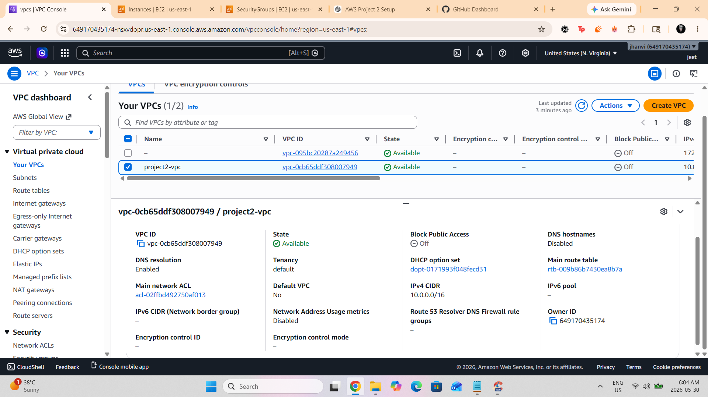

---

### 🗂️ 2. Public & Private Subnets

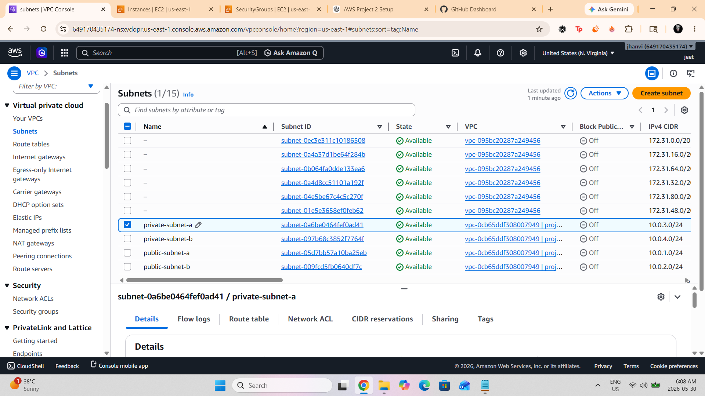

---

### 🛣️ 3. Route Tables

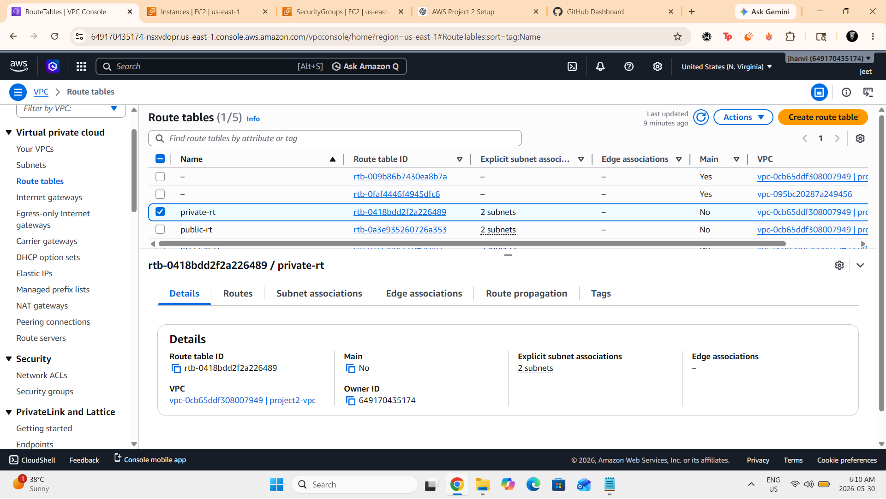

---

### 🌍 4. Internet Gateway

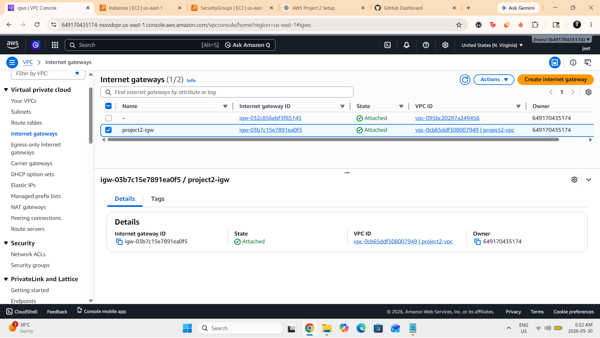

---

### ⚙️ 5. Frontend Launch Template

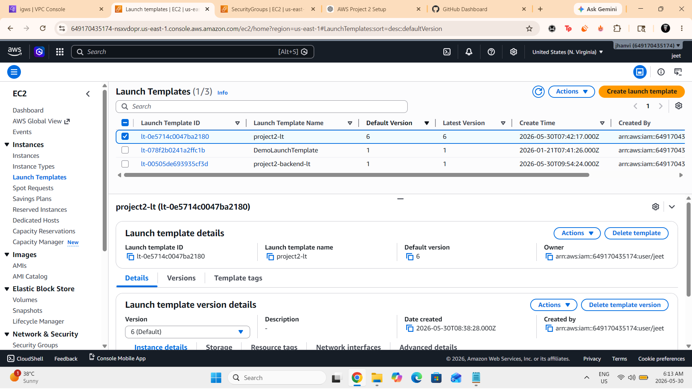

---

### ⚙️ 6. Backend Launch Template

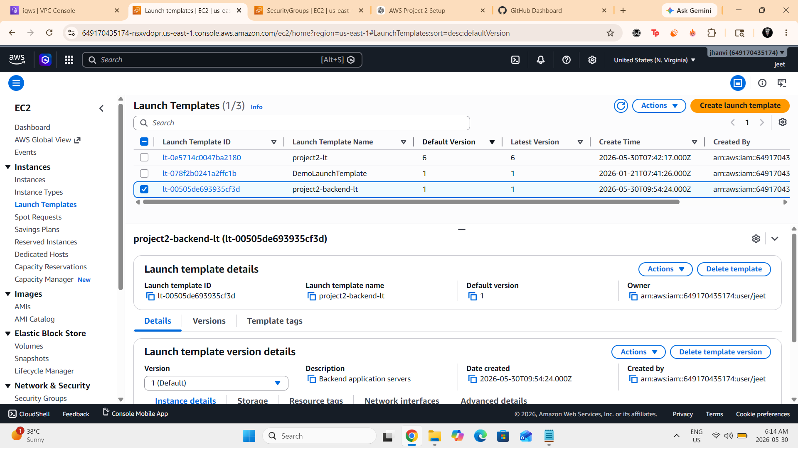

---

### 📈 7. Frontend Auto Scaling Group

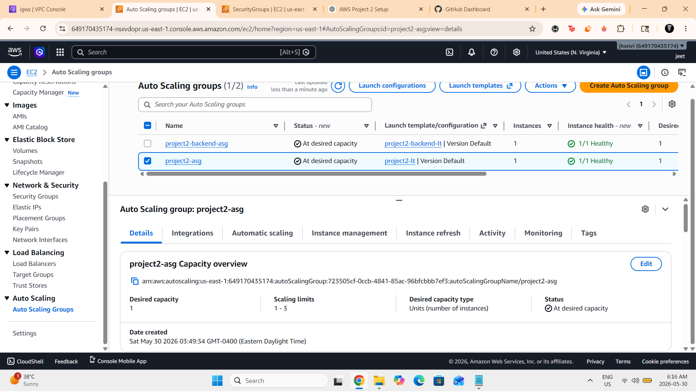

---

### 📈 8. Backend Auto Scaling Group

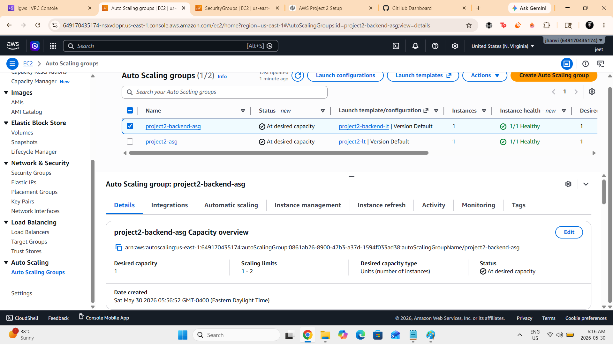

---

### 🖥️ 9. EC2 Instances

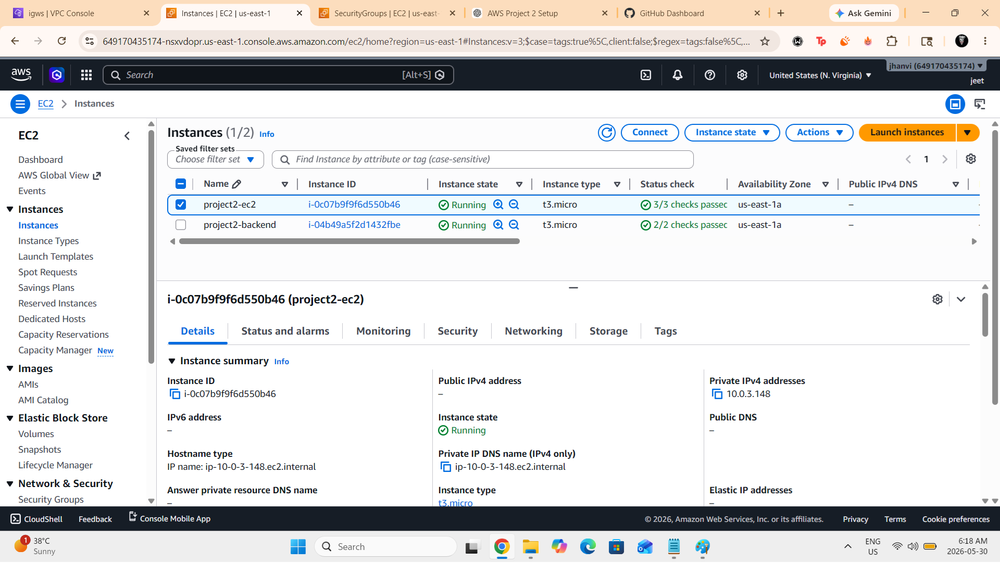

---

### 🔐 10. Security Groups

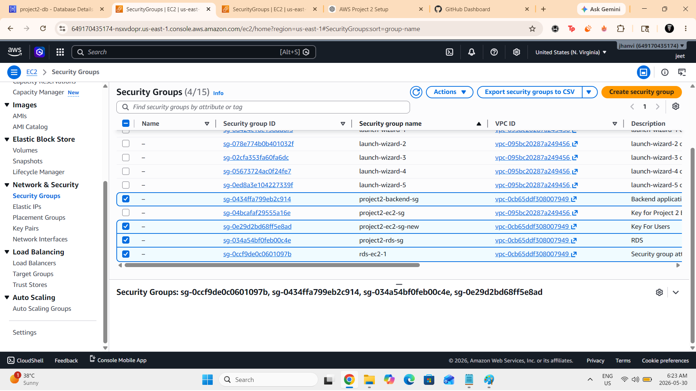

---

### 🗄️ 11. Amazon RDS Database

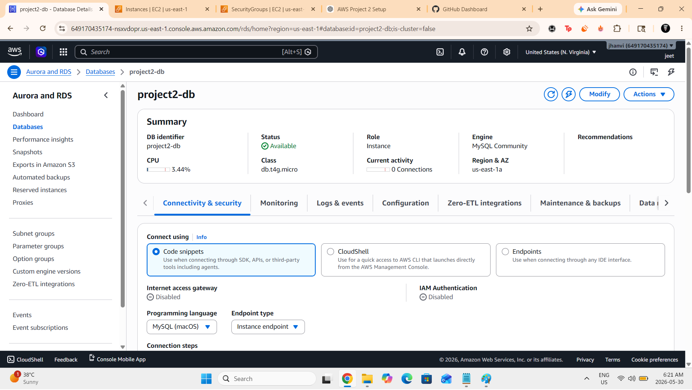

---

### 🔗 12. RDS Connectivity & Security

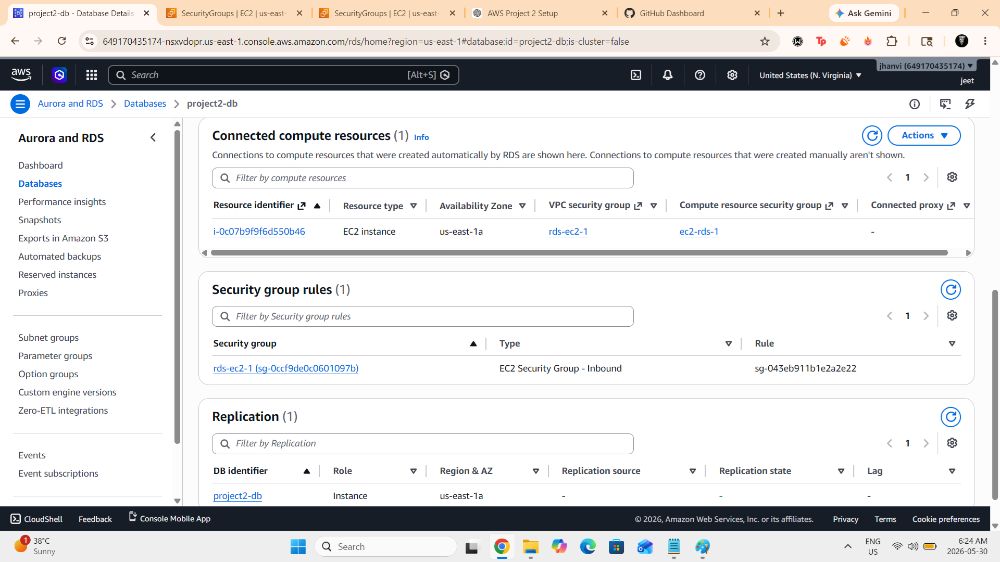

---

## 📘 How This Project Works

### ✔️ Step 1 — Create Networking Infrastructure

* Created a custom VPC
* Configured public and private subnets
* Attached an Internet Gateway
* Created route tables

### ✔️ Step 2 — Configure Security

* Created Security Groups
* Controlled inbound and outbound traffic
* Restricted database access

### ✔️ Step 3 — Deploy Frontend Tier

* Created EC2 Launch Template
* Created Frontend Auto Scaling Group
* Configured networking and security

### ✔️ Step 4 — Deploy Backend Tier

* Created Backend Launch Template
* Created Backend Auto Scaling Group
* Deployed resources into private subnets

### ✔️ Step 5 — Deploy Database Layer

* Created DB Subnet Group
* Deployed Amazon RDS MySQL
* Configured database connectivity

### ✔️ Step 6 — Validate Infrastructure

* Verified EC2 instances
* Verified Auto Scaling Groups
* Verified database availability
* Tested networking configuration

---

## 💼 What I Learned

* Designing custom VPC architectures
* Creating public and private subnet strategies
* Configuring route tables and internet access
* Implementing Security Groups
* Deploying EC2 Launch Templates
* Managing Auto Scaling Groups
* Deploying Amazon RDS MySQL
* Understanding multi-tier cloud architectures
* Applying AWS infrastructure best practices

---

## 🧩 Future Improvements

* Application Load Balancer (ALB)
* NAT Gateway
* Amazon CloudWatch Monitoring
* AWS Systems Manager
* Terraform Automation
* CI/CD with GitHub Actions
* Route 53 DNS Integration

---

## 🏷️ Project Tags

AWS • Amazon VPC • EC2 • Auto Scaling • Launch Templates • Amazon RDS • MySQL • Cloud Infrastructure • Networking • Security Groups • Cloud Computing • AWS Architecture

---

## 🔗 Connect With Me

GitHub: https://github.com/jeetzala

LinkedIn: https://www.linkedin.com/in/jeet-zala-6633832ba/

---

## 🏆 Credits

Built by Jeet Zala as part of my AWS Cloud learning journey and cloud infrastructure portfolio.

The infrastructure consists of:

* Custom Amazon VPC
* Public and Private Subnets across multiple Availability Zones
* Internet Gateway
* Route Tables
* Frontend EC2 Auto Scaling Group
* Backend EC2 Auto Scaling Group
* Launch Templates
* Security Groups
* Amazon RDS MySQL Database

### High-Level Flow

Internet → Frontend Tier → Backend Tier → RDS Database

## AWS Services Used

* Amazon VPC
* Amazon EC2
* EC2 Launch Templates
* EC2 Auto Scaling Groups
* Amazon RDS (MySQL)
* Security Groups
* Internet Gateway
* Route Tables

## Network Design

### VPC

CIDR Block:

10.0.0.0/16

### Public Subnets

* public-subnet-a
* public-subnet-b

### Private Subnets

* private-subnet-a
* private-subnet-b

## Security

Security Groups were configured to control communication between infrastructure components and limit unnecessary exposure.

## Database Layer

Amazon RDS MySQL was deployed inside the VPC with controlled access through security groups.

## Screenshots

### VPC Overview


### Subnets


### Route Tables


### Internet Gateway


### Frontend Auto Scaling Group


### Backend Auto Scaling Group


### EC2 Instances


### RDS Database


See the screenshots folder for deployment evidence and configuration details.

## Key Learning Outcomes

* Designing custom VPC architectures
* Creating public and private subnet strategies
* Configuring route tables and internet access
* Deploying EC2 Launch Templates
* Implementing Auto Scaling Groups
* Managing Security Groups
* Deploying and managing Amazon RDS
* Understanding multi-tier AWS architectures

## Author

Jeet Zala
AWS Cloud Portfolio Project

