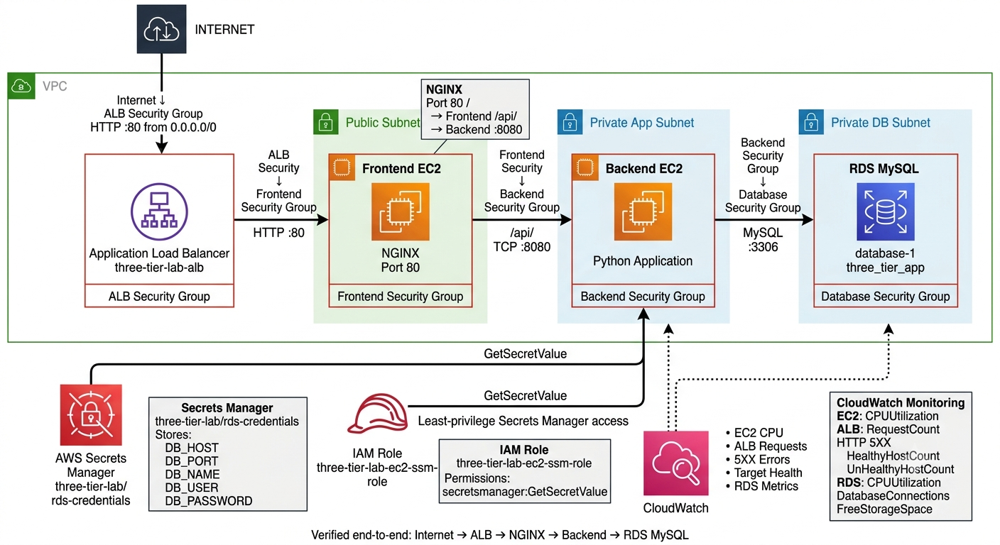
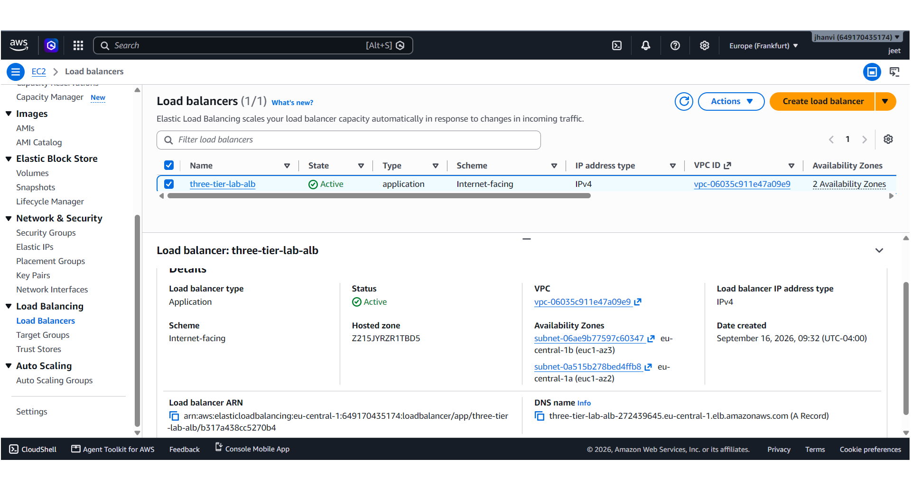
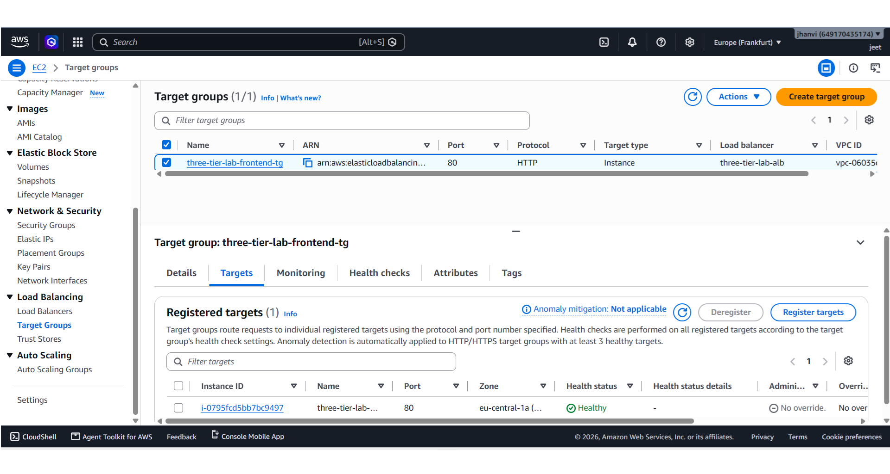
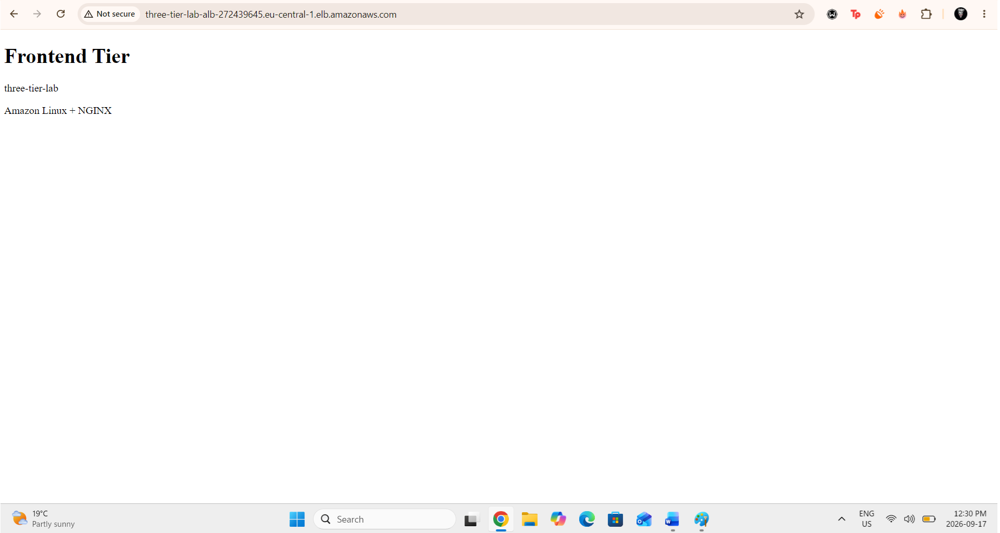
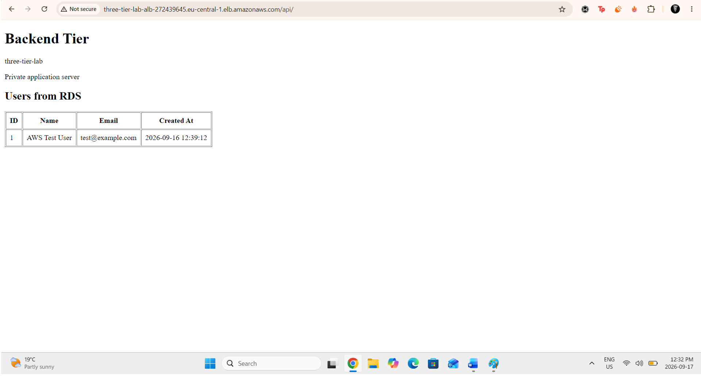
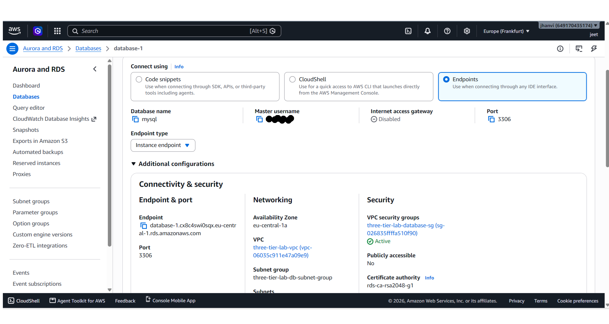
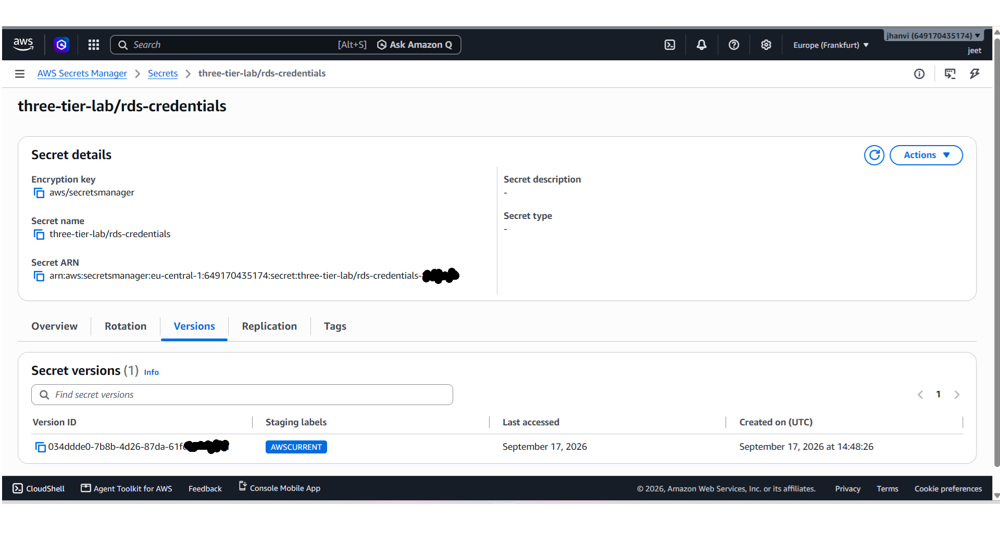
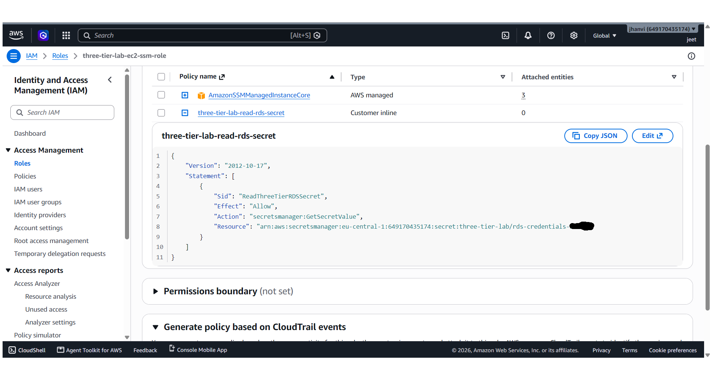
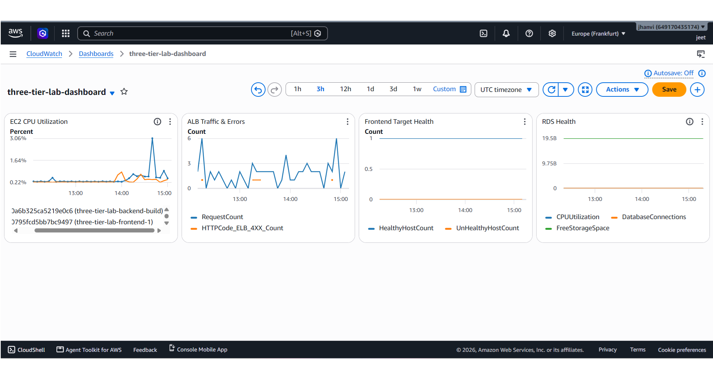

# ☁️ AWS 3-Tier Infrastructure Project

This project demonstrates the design and deployment of a secure, multi-tier application infrastructure on **Amazon Web Services (AWS)** using a custom VPC, public and private subnets, an **Application Load Balancer (ALB)**, **NGINX**, **Amazon EC2**, **Amazon RDS MySQL**, **AWS Secrets Manager**, **IAM**, **Amazon CloudWatch**, and **Terraform**.

The architecture separates the application into frontend, backend, and database tiers while implementing restricted communication between each layer.

The project was rebuilt and validated in the **AWS Europe (Frankfurt) Region (`eu-central-1`)**.

---

# 🚀 Project Highlights

✅ Custom Amazon VPC

✅ Public & Private Subnets

✅ Internet Gateway & Route Tables

✅ Application Load Balancer (ALB)

✅ Frontend EC2 with NGINX

✅ Backend EC2 with Python Application

✅ NGINX Reverse Proxy

✅ Amazon RDS MySQL

✅ AWS Secrets Manager

✅ IAM Least-Privilege Access

✅ CloudWatch Monitoring & Alarms

✅ Tiered Security Groups

✅ Terraform Infrastructure as Code

✅ End-to-End Application Validation

✅ Secure Frontend → Backend → Database Communication

---

# 🏗️ Architecture Overview

## Architecture Diagram



The infrastructure is organized into three main application tiers:

```text
Internet
   │
   ▼
Application Load Balancer
   │
   │ HTTP :80
   ▼
Frontend EC2
NGINX :80
   │
   │ /api/ → TCP :8080
   ▼
Backend EC2
Python Application :8080
   │
   │ MySQL :3306
   ▼
Amazon RDS MySQL
three_tier_app
```

Supporting AWS services provide security and observability:

```text
Backend EC2
   │
   ├── IAM Role
   │      └── secretsmanager:GetSecretValue
   │
   ├── AWS Secrets Manager
   │      └── RDS credentials
   │
   └── CloudWatch
          └── CPU, ALB, Target Health, RDS metrics
```

Terraform is used to define and manage the deployed infrastructure as code.

---

# 🧱 Infrastructure Components

### Networking

* Amazon VPC
* Public Subnets
* Private Application Subnets
* Private Database Subnets
* Internet Gateway
* Route Tables

### Compute & Application

* Application Load Balancer
* Amazon EC2
* NGINX
* Python HTTP Backend
* PyMySQL

### Database

* Amazon RDS MySQL
* DB Subnet Group
* `three_tier_app` database
* `users` table

### Security & Operations

* Security Groups
* AWS IAM Role
* AWS Secrets Manager
* Amazon CloudWatch
* AWS Systems Manager Session Manager

### Infrastructure as Code

* Terraform
* Terraform variables
* Terraform outputs
* Terraform resource imports
* Terraform state management
* Infrastructure drift validation

---

# 🧰 AWS Services Used

* Amazon VPC
* Amazon EC2
* Application Load Balancer
* Amazon RDS
* Amazon CloudWatch
* AWS Secrets Manager
* AWS IAM
* AWS Systems Manager
* Internet Gateway
* Route Tables
* Security Groups

### Infrastructure as Code

* Terraform

---

# 🔐 Security Architecture

Each application tier only accepts the traffic required from the tier directly in front of it.

```text
Internet
   │
   │ HTTP :80
   ▼
ALB Security Group
   │
   │ HTTP :80
   ▼
Frontend Security Group
   │
   │ TCP :8080
   ▼
Backend Security Group
   │
   │ MySQL :3306
   ▼
Database Security Group
```

### Security Group Rules

**ALB Security Group**

```text
HTTP :80
Source: 0.0.0.0/0
```

**Frontend Security Group**

```text
HTTP :80
Source: ALB Security Group
```

**Backend Security Group**

```text
TCP :8080
Source: Frontend Security Group
```

**Database Security Group**

```text
MySQL :3306
Source: Backend Security Group
```

This prevents direct public access to the backend and database tiers.

---

# 🔑 Secrets Management

Database credentials are stored in **AWS Secrets Manager** rather than being hard-coded into the application.

Secret:

```text
three-tier-lab/rds-credentials
```

The backend receives access through the EC2 IAM role:

```text
three-tier-lab-ec2-ssm-role
```

The application retrieves the secret using:

```text
secretsmanager:GetSecretValue
```

The application does not store the actual RDS password in the GitHub repository.

---

# 📊 CloudWatch Monitoring

CloudWatch is used to monitor the infrastructure and application environment.

### EC2

* CPU Utilization
* Frontend CPU Alarm
* Backend CPU Alarm

### Application Load Balancer

* Request Count
* HTTP 5XX Errors
* Healthy Host Count
* Unhealthy Host Count

### RDS

* CPU Utilization
* Database Connections
* Free Storage Space

Dashboard:

```text
three-tier-lab-dashboard
```

---

# 📁 Project Structure

```text
aws-3tier-infrastructure-project/
│
├── README.md
├── .gitignore
│
├── app/
│   ├── app.py
│   └── requirements.txt
│
├── diagrams/
│   └── architecture-diagram.png
│
├── screenshots/
│   ├── alb.png
│   ├── alb-target-health.png
│   ├── frontend.png
│   ├── backend-rds.png
│   ├── rds.png
│   ├── secrets-manager.png
│   ├── iam.png
│   └── cloudwatch-dashboard.png
│
└── terraform/
    ├── main.tf
    ├── variables.tf
    ├── outputs.tf
    ├── vpc.tf
    ├── igw.tf
    ├── subnets.tf
    ├── route_tables.tf
    ├── security_groups.tf
    ├── iam.tf
    ├── ec2.tf
    ├── alb.tf
    ├── rds.tf
    ├── secrets.tf
    ├── terraform.tfvars.example
    ├── .gitignore
    └── .terraform.lock.hcl
```

Terraform state files and the `.terraform` working directory are intentionally excluded from the repository.

---

# 📸 Screenshots

## 🌐 1. Application Load Balancer



The Application Load Balancer provides the public entry point for the application.

---

## ✅ 2. ALB Target Health



The frontend EC2 target is registered with the target group and verified as healthy.

---

## 🖥️ 3. Frontend Application



The frontend is served through NGINX running on the frontend EC2 instance.

---

## 🔗 4. Backend → RDS Application Test



The backend retrieves user data from Amazon RDS MySQL.

The application successfully returned:

```text
ID: 1
Name: AWS Test User
Email: test@example.com
```

This validates the complete application path:

```text
ALB → NGINX → Backend → RDS
```

---

## 🗄️ 5. Amazon RDS MySQL



The database tier is hosted using Amazon RDS MySQL inside the private database layer.

Database:

```text
three_tier_app
```

Table:

```text
users
```

---

## 🔐 6. AWS Secrets Manager



RDS connection credentials are stored securely in AWS Secrets Manager.

The database password is intentionally not included in the repository.

---

## 🛡️ 7. IAM Least-Privilege Policy



The backend EC2 IAM role is granted the minimum permission required to retrieve the application secret:

```text
secretsmanager:GetSecretValue
```

---

## 📈 8. CloudWatch Monitoring Dashboard



The CloudWatch dashboard provides visibility into:

* EC2 CPU utilization
* ALB traffic and errors
* Target health
* RDS health metrics

---

# 🧩 Infrastructure as Code with Terraform

The deployed AWS 3-tier environment is managed using **Terraform Infrastructure as Code**.

The existing AWS resources were imported into Terraform rather than recreated.

Terraform manages the following infrastructure layers:

### Networking

```text
VPC
Internet Gateway
6 Subnets
3 Route Tables
6 Route Table Associations
```

### Security

```text
ALB Security Group
Frontend Security Group
Backend Security Group
Database Security Group
ALB Security Group VPC Association
```

### IAM

```text
EC2 IAM Role
EC2 Instance Profile
AmazonSSMManagedInstanceCore
Secrets Manager access policy
```

### Compute

```text
Frontend EC2
Backend EC2
```

### Load Balancing

```text
Application Load Balancer
Frontend Target Group
HTTP Listener
Frontend Target Registration
```

### Database & Secrets

```text
RDS DB Subnet Group
Amazon RDS MySQL
AWS Secrets Manager
```

### Terraform Validation

The Terraform configuration was formatted and validated using:

```bash
terraform fmt -recursive
terraform validate
terraform plan
```

The imported infrastructure was reconciled against the Terraform configuration with no infrastructure resources requiring creation, modification, or destruction.

Terraform validation returned:

```text
Success! The configuration is valid.
```

The infrastructure plan was verified with:

```text
0 to add
0 to change
0 to destroy
```

Terraform outputs are also defined for important infrastructure information such as:

```text
VPC ID
ALB DNS Name
ALB ARN
Frontend Instance ID
Backend Instance ID
Subnet IDs
RDS Endpoint
RDS Port
Secrets Manager ARN
```

### Terraform Security

The actual RDS password and other credential values are not stored in the Terraform configuration.

Terraform state files are excluded from GitHub using `.gitignore`.

The `terraform.tfvars.example` file contains example configuration values without database passwords or other secret values.

---

# 📘 How This Project Works

## ✔️ Step 1 — Create Networking Infrastructure

Created:

* Custom VPC
* Public subnets
* Private application subnets
* Private database subnets
* Internet Gateway
* Route tables
* Subnet associations

---

## ✔️ Step 2 — Configure Security

Created separate Security Groups for:

* ALB
* Frontend
* Backend
* Database

Traffic between tiers is restricted to the required ports.

---

## ✔️ Step 3 — Deploy Frontend Tier

The frontend EC2 instance runs:

```text
NGINX :80
```

NGINX serves the frontend application and forwards API requests using:

```text
/api/
```

to the backend application.

---

## ✔️ Step 4 — Deploy Backend Tier

The backend EC2 instance runs a Python application on:

```text
TCP :8080
```

The backend uses **PyMySQL** to communicate with the RDS database.

---

## ✔️ Step 5 — Deploy Database Layer

Created:

* RDS DB Subnet Group
* Amazon RDS MySQL instance
* `three_tier_app` database
* `users` table

Database connectivity was tested from the backend EC2 instance.

---

## ✔️ Step 6 — Secure Database Credentials

Created an AWS Secrets Manager secret:

```text
three-tier-lab/rds-credentials
```

The backend EC2 IAM role retrieves the credentials at runtime.

---

## ✔️ Step 7 — Configure Monitoring

Created CloudWatch monitoring for:

* Frontend CPU
* Backend CPU
* ALB traffic
* ALB errors
* Target health
* RDS metrics

---

## ✔️ Step 8 — Validate the Application

The infrastructure was tested layer by layer.

### Frontend

```text
ALB → Frontend EC2 → NGINX
```

✅ Verified

### Backend

```text
NGINX → Backend EC2 :8080
```

✅ Verified

### Database

```text
Backend EC2 → RDS MySQL :3306
```

✅ Verified

### Application

```text
ALB → NGINX → Python Backend → RDS
```

✅ Verified

The application successfully retrieved data from the RDS `users` table.

---

## ✔️ Step 9 — Manage Infrastructure with Terraform

The existing AWS environment was imported into Terraform.

Terraform configuration was organized into separate files for:

* Networking
* Security Groups
* IAM
* EC2
* ALB
* RDS
* Secrets Manager
* Variables
* Outputs

The infrastructure was then validated using:

```bash
terraform fmt -recursive
terraform validate
terraform plan
```

✅ Terraform configuration validated

✅ Existing AWS resources imported

✅ No infrastructure resources proposed for creation, modification, or destruction

---

# 🧪 Validation Results

| Component                  | Status     |
| -------------------------- | ---------- |
| VPC & Subnets              | ✅ Verified |
| Route Tables               | ✅ Verified |
| Security Groups            | ✅ Verified |
| Application Load Balancer  | ✅ Verified |
| Frontend NGINX             | ✅ Verified |
| Backend Python Service     | ✅ Verified |
| Backend → RDS Connectivity | ✅ Verified |
| MySQL Authentication       | ✅ Verified |
| Secrets Manager            | ✅ Verified |
| IAM Least Privilege        | ✅ Verified |
| CloudWatch Monitoring      | ✅ Verified |
| Terraform Configuration    | ✅ Verified |
| Terraform Infrastructure   | ✅ Verified |
| End-to-End Application     | ✅ Verified |

---

# 💼 What I Learned

* Designing multi-tier AWS network architectures
* Creating public and private subnet strategies
* Configuring route tables and Internet Gateway connectivity
* Implementing tier-based Security Groups
* Configuring Application Load Balancers
* Deploying and configuring NGINX
* Building a Python backend service
* Connecting EC2 applications to Amazon RDS MySQL
* Using PyMySQL for database access
* Managing application secrets with AWS Secrets Manager
* Applying IAM least-privilege principles
* Monitoring AWS infrastructure with CloudWatch
* Troubleshooting private network connectivity
* Using Terraform to manage AWS infrastructure as code
* Importing existing AWS resources into Terraform
* Using Terraform variables and outputs
* Validating infrastructure with `terraform plan`
* Documenting cloud infrastructure for a technical portfolio

---

# 🧩 Future Improvements

### High Availability

* Multiple frontend instances
* Multiple backend instances
* Auto Scaling Groups
* Multi-AZ application deployment

### Security

* HTTPS with ACM
* HTTPS listener on the ALB
* Route 53 DNS
* Additional IAM hardening
* Automated secret rotation

### Terraform

* Reusable Terraform modules
* Improved variable organization
* Remote Terraform state management

### CI/CD

* GitHub Actions
* Automated testing
* Automated deployment

---

# 🏷️ Project Tags

**AWS • Amazon VPC • EC2 • Application Load Balancer • NGINX • Python • Amazon RDS • MySQL • Secrets Manager • IAM • CloudWatch • Systems Manager • Terraform • Networking • Security Groups • Cloud Infrastructure • Cloud Computing • AWS Architecture**

---

# 🔗 Connect With Me

GitHub:
https://github.com/jeetzala

LinkedIn:
https://www.linkedin.com/in/jeet-zala-6633832ba/

---

# 🏆 Credits

Built by **Jeet Zala** as part of my AWS Cloud learning journey and cloud infrastructure portfolio.

## Author

**Jeet Zala**
AWS Cloud & Infrastructure Portfolio Project
